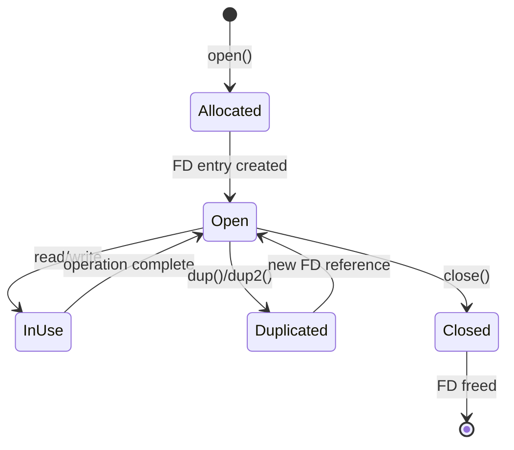

# Demo 02: File Operations

## Overview

This demo showcases file I/O syscalls in gem5:
- `open()` - Open files
- `read()` - Read from files
- `write()` - Write to files
- `close()` - Close files
- `stat()`/`fstat()` - Get file information
- `mkdir()` - Create directories
- `unlink()` - Delete files

## What You'll Learn

- File descriptor lifecycle
- Path redirection in gem5
- Error handling (ENOENT, EACCES, etc.)
- File metadata operations
- Directory operations

## Files

- `fileops.c` - Comprehensive file operations demo
- `reader.c` - Read from file
- `writer.c` - Write to file
- `dirops.c` - Directory operations
- `Makefile` - Build script
- `run.sh` - Run all demos

## Quick Start

```bash
make
./run.sh
```

## Demo Programs

### 1. fileops.c - Complete File I/O

```c
#include <fcntl.h>
#include <unistd.h>
#include <sys/stat.h>
#include <stdio.h>
#include <string.h>
#include <errno.h>

int main() {
    int fd;
    char buffer[256];
    ssize_t n;
    struct stat st;
    
    // 1. Create and write to file
    printf("=== Writing to file ===\n");
    fd = open("/tmp/gem5_test.txt", O_CREAT | O_WRONLY | O_TRUNC, 0644);
    if (fd < 0) {
        perror("open for write");
        return 1;
    }
    printf("Opened file for writing (fd=%d)\n", fd);
    
    const char *data = "Hello from gem5 file operations!\n";
    n = write(fd, data, strlen(data));
    printf("Wrote %zd bytes\n", n);
    
    close(fd);
    printf("Closed file\n");
    
    // 2. Read from file
    printf("\n=== Reading from file ===\n");
    fd = open("/tmp/gem5_test.txt", O_RDONLY);
    if (fd < 0) {
        perror("open for read");
        return 1;
    }
    printf("Opened file for reading (fd=%d)\n", fd);
    
    n = read(fd, buffer, sizeof(buffer) - 1);
    if (n > 0) {
        buffer[n] = '\0';
        printf("Read %zd bytes: %s", n, buffer);
    }
    
    close(fd);
    
    // 3. Get file stats
    printf("\n=== File statistics ===\n");
    if (stat("/tmp/gem5_test.txt", &st) == 0) {
        printf("File size: %ld bytes\n", st.st_size);
        printf("File mode: 0%o\n", st.st_mode & 0777);
        printf("Inode: %ld\n", st.st_ino);
    }
    
    // 4. Delete file
    printf("\n=== Deleting file ===\n");
    if (unlink("/tmp/gem5_test.txt") == 0) {
        printf("File deleted successfully\n");
    }
    
    return 0;
}
```

### 2. dirops.c - Directory Operations

```c
#include <sys/stat.h>
#include <sys/types.h>
#include <fcntl.h>
#include <unistd.h>
#include <stdio.h>
#include <errno.h>
#include <dirent.h>

int main() {
    // Create directory
    printf("=== Creating directory ===\n");
    if (mkdir("/tmp/gem5_testdir", 0755) == 0) {
        printf("Directory created: /tmp/gem5_testdir\n");
    } else if (errno == EEXIST) {
        printf("Directory already exists\n");
    }
    
    // Create file in directory
    int fd = open("/tmp/gem5_testdir/file1.txt", O_CREAT | O_WRONLY, 0644);
    if (fd >= 0) {
        write(fd, "test\n", 5);
        close(fd);
        printf("Created file in directory\n");
    }
    
    // List directory contents
    printf("\n=== Directory contents ===\n");
    DIR *dir = opendir("/tmp/gem5_testdir");
    if (dir) {
        struct dirent *entry;
        while ((entry = readdir(dir)) != NULL) {
            printf("  %s\n", entry->d_name);
        }
        closedir(dir);
    }
    
    // Clean up
    printf("\n=== Cleaning up ===\n");
    unlink("/tmp/gem5_testdir/file1.txt");
    rmdir("/tmp/gem5_testdir");
    printf("Cleanup complete\n");
    
    return 0;
}
```

## Syscalls Demonstrated

### open()
```c
int open(const char *pathname, int flags, mode_t mode);
```

**Flags:**
- `O_RDONLY` - Read only
- `O_WRONLY` - Write only
- `O_RDWR` - Read and write
- `O_CREAT` - Create if doesn't exist
- `O_TRUNC` - Truncate to zero length
- `O_APPEND` - Append to end

**gem5 behavior:**
- Translates target FD to host FD
- May redirect paths (e.g., /proc, /sys)
- Creates FDEntry in process FD table

### read()
```c
ssize_t read(int fd, void *buf, size_t count);
```

**gem5 flow:**
1. Look up FD entry
2. Allocate host buffer
3. Read from host FD
4. Copy to guest memory
5. Return bytes read

### write()
```c
ssize_t write(int fd, const void *buf, size_t count);
```

**gem5 flow:**
1. Look up FD entry
2. Copy from guest memory to host buffer
3. Write to host FD
4. Return bytes written

### stat() / fstat()
```c
int stat(const char *pathname, struct stat *statbuf);
int fstat(int fd, struct stat *statbuf);
```

**gem5 behavior:**
- Calls host stat/fstat
- Translates stat structure
- Some fields may differ (device numbers, etc.)

## Path Redirection

gem5 redirects certain paths for simulation:

```
Guest Path               Host Path
─────────────────────────────────────────
/proc/cpuinfo       →    [generated on-the-fly]
/sys/devices        →    [simulated device tree]
/dev/urandom        →    host /dev/urandom
/tmp/*              →    host /tmp/*
/home/user/*        →    host /home/user/*
```

**To see redirections:**
```bash
gem5.opt --debug-flags=SyscallVerbose config.py
```

## Error Handling Examples

### ENOENT - File not found
```c
int fd = open("/nonexistent.txt", O_RDONLY);
if (fd < 0) {
    perror("open");  // "open: No such file or directory"
}
```

### EACCES - Permission denied
```c
int fd = open("/root/secret.txt", O_RDONLY);
if (fd < 0) {
    perror("open");  // "open: Permission denied"
}
```

### EBADF - Bad file descriptor
```c
read(999, buffer, 100);  // Invalid FD
// Returns -EBADF
```

## FD Lifecycle Visualization



## Performance Notes

**Overhead per syscall:**
- `open()`: 1000-5000 cycles
- `read()`: 500-2000 cycles per KB
- `write()`: 500-2000 cycles per KB
- `close()`: 100-500 cycles
- `stat()`: 500-1000 cycles

**Optimization tips:**
- Batch reads/writes when possible
- Keep files open rather than open/close frequently
- Use buffered I/O (stdio)

## Common Issues

### Issue 1: "Permission denied"
**Cause:** File doesn't have correct permissions  
**Solution:** Check file permissions on host system

### Issue 2: "Too many open files"
**Cause:** Leaked file descriptors  
**Solution:** Always close FDs when done

### Issue 3: "No such file or directory"
**Cause:** Path doesn't exist or is redirected  
**Solution:** Check path redirections with --debug-flags

## Exercises

1. **Modify fileops.c** to handle errors gracefully
2. **Create a program** that copies a file using read/write
3. **Implement a simple `cat`** command using syscalls
4. **Write a program** that creates 100 files and measures performance

## Next Steps

- **Demo 03:** Process management (fork, exec)
- **Demo 04:** Threading and synchronization
- Explore the [FD translation visualizer](../../visualization/fd-mapper.py)

---

**[⬆ back to demos](../)**
