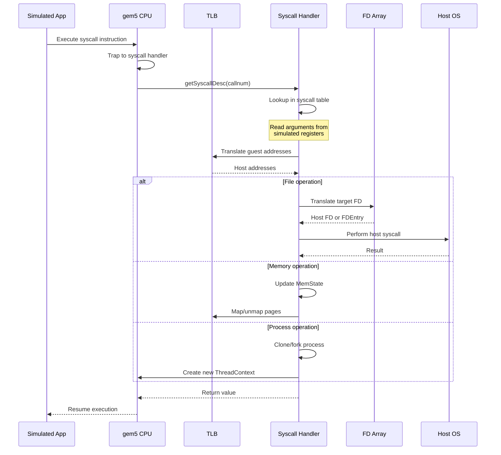

# 🏗️ gem5 Syscall Emulation Architecture

## Table of Contents
- [Overview](#overview)
- [Core Components](#core-components)
- [Syscall Flow](#syscall-flow)
- [Key Data Structures](#key-data-structures)
- [Design Patterns](#design-patterns)
- [Extension Points](#extension-points)

---

## Overview

The gem5 syscall emulation (SE) mode provides a lightweight alternative to full-system (FS) simulation. Instead of booting a complete operating system, SE mode intercepts system calls from the simulated application and handles them directly in the simulator.

### Why Syscall Emulation?

**Advantages:**
- ⚡ **Faster simulation** - No OS overhead
- 🎯 **Focused analysis** - Study application behavior without OS noise
- 🔧 **Easier setup** - No kernel images or disk images required
- 💻 **Host integration** - Leverage host OS capabilities

**Trade-offs:**
- ❌ No kernel-level simulation
- ❌ Limited multi-process scenarios
- ❌ No device driver simulation
- ❌ Simplified I/O model

---

## Core Components

### 1. Process Class (`src/sim/process.hh/cc`)

The `Process` class represents a simulated user-space process. It manages:

```cpp
class Process : public SimObject
{
  protected:
    // Executable object
    loader::ObjectFile *objFile;
    
    // Memory management
    std::shared_ptr<MemState> memState;
    
    // File descriptor array
    std::shared_ptr<FDArray> fds;
    
    // System call table
    std::vector<SyscallDesc*> syscallDescs;
    
    // Thread contexts
    std::vector<ThreadContext *> threads;
    
  public:
    // Initialize process from binary
    virtual void initState();
    
    // Allocate memory regions
    virtual void allocateMem(Addr vaddr, int64_t size, bool clobber = false);
    
    // Map system calls
    SyscallDesc* getDesc(int callnum);
};
```

**Key Responsibilities:**
- Load executable binary and initialize memory layout
- Manage virtual address space
- Maintain file descriptor table
- Map syscall numbers to handler functions
- Track thread contexts

### 2. Syscall Descriptor (`src/sim/syscall_desc.hh/cc`)

The `SyscallDesc` class defines the interface for syscall handlers:

```cpp
class SyscallDesc
{
  protected:
    // Syscall name (e.g., "open", "read")
    std::string name;
    
    // Implementation function pointer
    SyscallReturn (*execFunc)(SyscallDesc *desc, ThreadContext *tc);
    
    // Flags (e.g., unimplemented, needs retry)
    int flags;
    
  public:
    // Execute the syscall
    SyscallReturn operator()(ThreadContext *tc);
    
    // Check if implemented
    bool needsRetry() const;
};
```

**Architecture-Specific Tables:**

Each ISA defines its own syscall table mapping numbers to descriptors:

```cpp
// Example from src/arch/x86/linux/syscall_tbl64.hh
std::array<SyscallDesc, 314> syscall_descs = {{
    {  0, "read", readFunc },
    {  1, "write", writeFunc },
    {  2, "open", openFunc },
    {  3, "close", closeFunc },
    // ... more syscalls
}};
```

### 3. Syscall Emulation Layer (`src/sim/syscall_emul.hh/cc`)

The core emulation functions that implement syscall logic:

```cpp
// Generic syscall implementations
template <class OS>
SyscallReturn
openFunc(SyscallDesc *desc, ThreadContext *tc,
         Addr pathname, int flags, int mode)
{
    // 1. Read pathname from simulated memory
    std::string path;
    if (!tc->getVirtProxy().tryReadString(path, pathname))
        return -EFAULT;
    
    // 2. Apply redirections (e.g., /proc, /sys)
    path = Process::redirectPath(path);
    
    // 3. Call host open()
    int hostFd = open(path.c_str(), flags, mode);
    if (hostFd == -1)
        return -errno;
    
    // 4. Allocate target FD
    auto fde = std::make_shared<FileFDEntry>(hostFd, flags, path, false);
    int targetFd = process->fds->allocFD(fde);
    
    // 5. Return target FD to simulated program
    return targetFd;
}
```

### 4. File Descriptor Array (`src/sim/fd_array.hh/cc`)

Manages the translation between target (simulated) and host file descriptors:

```cpp
class FDArray
{
  protected:
    // Map of target FD -> FDEntry
    std::map<int, std::shared_ptr<FDEntry>> fdMap;
    
  public:
    // Allocate a new FD
    int allocFD(std::shared_ptr<FDEntry> fde);
    
    // Get FD entry
    std::shared_ptr<FDEntry> getFDEntry(int tgt_fd);
    
    // Close FD
    void closeFD(int tgt_fd);
};

class FDEntry
{
  protected:
    // File descriptor flags
    int flags;
    
  public:
    // Read from FD
    virtual ssize_t read(uint8_t *buf, size_t len);
    
    // Write to FD
    virtual ssize_t write(const uint8_t *buf, size_t len);
};
```

**FD Types:**
- `FileFDEntry` - Regular files
- `PipeFDEntry` - Pipes
- `SocketFDEntry` - Sockets
- `DeviceFDEntry` - Special devices

### 5. Memory State (`src/sim/mem_state.hh/cc`)

Tracks virtual memory allocations and mappings:

```cpp
class MemState
{
  protected:
    // Next available break (heap end)
    Addr brkPoint;
    
    // Next available mmap address
    Addr mmapEnd;
    
    // Stack base and size
    Addr stackBase;
    Addr stackSize;
    
    // Virtual memory areas
    std::vector<VMA> vmaList;
    
  public:
    // Extend heap
    Addr extendBrk(Addr new_brk);
    
    // Memory map
    Addr mmap(Addr start, uint64_t length, int prot, int flags);
    
    // Unmap memory
    void munmap(Addr start, uint64_t length);
};
```

---

## Syscall Flow

Detailed step-by-step execution:



### Example: `open()` Syscall

Let's trace a complete `open("/tmp/test.txt", O_RDONLY)` call:

**Step 1: Application calls open()**
```c
int fd = open("/tmp/test.txt", O_RDONLY);
```

**Step 2: Compiler generates syscall instruction**
```asm
mov    $0x2,%eax              # syscall number for open
mov    $pathname,%rdi         # arg1: pathname pointer
mov    $O_RDONLY,%esi        # arg2: flags
syscall                        # trap to kernel
```

**Step 3: gem5 CPU intercepts syscall**
```cpp
// In CPU model
void syscall(int64_t callnum, ThreadContext *tc) {
    Process *p = tc->getProcessPtr();
    SyscallDesc *desc = p->getDesc(callnum);
    SyscallReturn ret = (*desc)(tc);
    tc->setIntReg(SyscallReturnReg, ret.encodedValue());
}
```

**Step 4: Syscall handler executes**
```cpp
SyscallReturn openFunc(SyscallDesc *desc, ThreadContext *tc) {
    // Extract arguments from registers
    Addr pathname_ptr = tc->readIntReg(ArgumentReg0);
    int flags = tc->readIntReg(ArgumentReg1);
    int mode = tc->readIntReg(ArgumentReg2);
    
    // Read pathname from guest memory
    std::string pathname;
    tc->getVirtProxy().readString(pathname, pathname_ptr);
    
    // Apply path redirections
    pathname = process->redirectPath(pathname);
    
    // Open on host
    int host_fd = ::open(pathname.c_str(), flags, mode);
    
    // Allocate target FD
    auto fde = std::make_shared<FileFDEntry>(host_fd, ...);
    int target_fd = process->fds->allocFD(fde);
    
    return target_fd;
}
```

**Step 5: Return to application**
```c
// fd now contains target FD (e.g., 3)
// which maps to host FD (e.g., 42)
```

---

## Key Data Structures

### Virtual Memory Layout

```
0xFFFFFFFF  ┌─────────────────┐
            │   Kernel Space  │ (not accessible in SE mode)
            │   (reserved)    │
0xC0000000  ├─────────────────┤
            │                 │
            │   Stack         │ (grows down)
            │      ↓          │
            │                 │
0xBFFFFFFF  ├─────────────────┤
            │                 │
            │   (unused)      │
            │                 │
mmapEnd  →  ├─────────────────┤
            │                 │
            │   mmap area     │ (grows down)
            │      ↓          │
            │                 │
            ├─────────────────┤
            │                 │
            │      ↑          │
            │   Heap (brk)    │ (grows up)
            │                 │
brkPoint →  ├─────────────────┤
            │   BSS           │ (uninitialized data)
            ├─────────────────┤
            │   Data          │ (initialized data)
            ├─────────────────┤
            │   Text          │ (code)
0x00400000  └─────────────────┘
```

### File Descriptor Table

```
Target FD    FDEntry Type         Host FD    Path/Info
─────────────────────────────────────────────────────
    0        FileFDEntry            0        stdin
    1        FileFDEntry            1        stdout
    2        FileFDEntry            2        stderr
    3        FileFDEntry           42        /tmp/test.txt
    4        SocketFDEntry         43        TCP socket
    5        PipeFDEntry         44,45       pipe
```

---

## Design Patterns

### 1. Template-Based OS Abstraction

Syscall functions are templated on OS type to handle differences:

```cpp
template <class OS>
SyscallReturn
ioctlFunc(SyscallDesc *desc, ThreadContext *tc, int fd, unsigned req)
{
    // OS-specific ioctl handling
    if (OS::isTTYReq(req))
        return OS::handleTTYioctl(fd, req, tc);
    
    return -ENOTTY;
}

// Instantiate for different OSes
template SyscallReturn ioctlFunc<Linux>(/* ... */);
template SyscallReturn ioctlFunc<FreeBSD>(/* ... */);
```

### 2. Proxy Objects for Memory Access

Safe access to simulated memory through proxy objects:

```cpp
SETranslatingPortProxy& proxy = tc->getVirtProxy();

// Read string from guest memory
std::string path;
proxy.readString(path, vaddr);

// Write buffer to guest memory
proxy.writeBlob(vaddr, buffer, size);

// Copy between guest and host
proxy.readBlob(guest_addr, host_buffer, size);
```

### 3. Visitor Pattern for FD Operations

Different FD types handle operations differently:

```cpp
class FDEntry {
    virtual ssize_t read(uint8_t *buf, size_t len) = 0;
    virtual ssize_t write(const uint8_t *buf, size_t len) = 0;
};

class FileFDEntry : public FDEntry {
    ssize_t read(uint8_t *buf, size_t len) override {
        return ::read(hostFd, buf, len);
    }
};

class SocketFDEntry : public FDEntry {
    ssize_t read(uint8_t *buf, size_t len) override {
        return ::recv(hostFd, buf, len, 0);
    }
};
```

---

## Extension Points

### Adding a New Syscall

1. **Define the handler function:**

```cpp
// In src/sim/syscall_emul.hh
template <class OS>
SyscallReturn
myNewSyscallFunc(SyscallDesc *desc, ThreadContext *tc,
                 int arg1, Addr arg2)
{
    // Implementation
    return 0;
}
```

2. **Add to syscall table:**

```cpp
// In src/arch/[arch]/[os]/syscall_tbl.hh
{ 999, "my_new_syscall", myNewSyscallFunc }
```

3. **Add tests:**

```cpp
// In tests/test-progs/my-syscall/
int main() {
    long result = syscall(999, arg1, arg2);
    assert(result == expected);
}
```

### Supporting a New Architecture

1. Create architecture-specific syscall table
2. Define register mappings for arguments
3. Handle architecture-specific data structures
4. Test with architecture-specific binaries

### Custom FD Types

Implement `FDEntry` interface for new descriptor types:

```cpp
class CustomFDEntry : public FDEntry {
  public:
    CustomFDEntry(int flags) : FDEntry(flags) {}
    
    ssize_t read(uint8_t *buf, size_t len) override {
        // Custom read logic
    }
    
    ssize_t write(const uint8_t *buf, size_t len) override {
        // Custom write logic
    }
};
```

---

## Performance Considerations

### Fast Path Optimizations

- **Inline common syscalls** - `read`, `write`, `getpid`
- **Cache syscall descriptors** - Avoid repeated lookups
- **Batch memory translations** - Reduce TLB overhead
- **Skip unnecessary checks** - Fast path for common cases

### Memory Management

- **Lazy allocation** - Only allocate pages on first access
- **Copy-on-write** - Share read-only pages
- **Huge pages** - Reduce TLB misses for large allocations

### Syscall Overhead

Typical overhead compared to native:
- Simple syscalls (getpid): 100-1000x
- I/O syscalls (read/write): 10-100x
- Complex syscalls (mmap): 5-50x

---

## Debugging Tips

### Enable Debug Flags

```bash
gem5.opt --debug-flags=Syscall,SyscallVerbose simulation.py
```

### Common Issues

1. **Segmentation faults**
   - Check address translations
   - Verify memory is allocated
   - Use `--debug-flags=PageTable`

2. **Wrong syscall behavior**
   - Compare with native strace
   - Check argument marshaling
   - Verify host syscall return values

3. **File descriptor leaks**
   - Track FD allocation/deallocation
   - Use `--debug-flags=SyscallAll`

---

## Further Reading

- [Syscall Flow Guide](syscall-flow.md) - Detailed execution traces
- [Tutorial](tutorial.md) - Hands-on examples
- [API Reference](api-reference.md) - Function documentation
- [gem5 Documentation](http://www.gem5.org/documentation)

---

**[⬆ back to top](#-gem5-syscall-emulation-architecture)**
