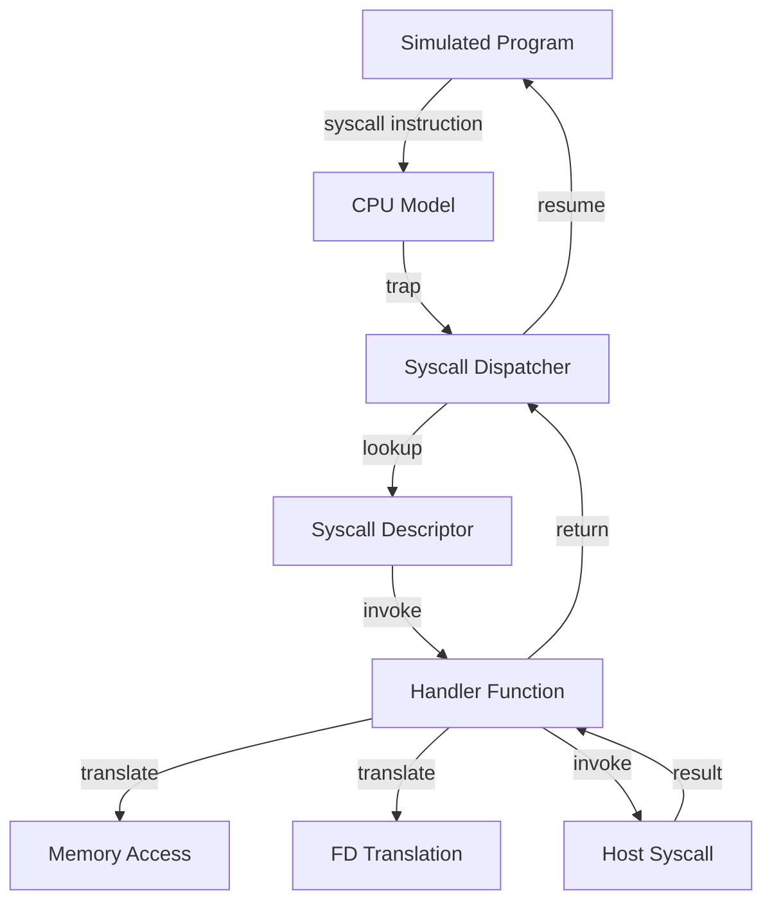
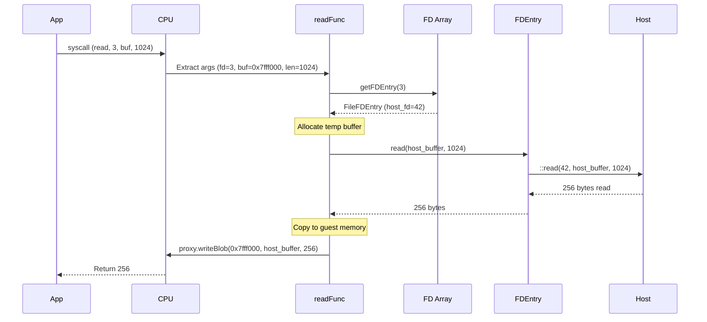
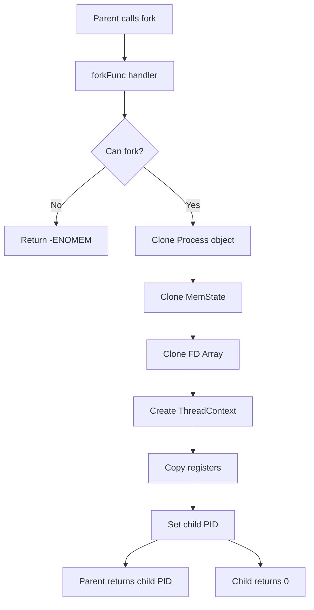
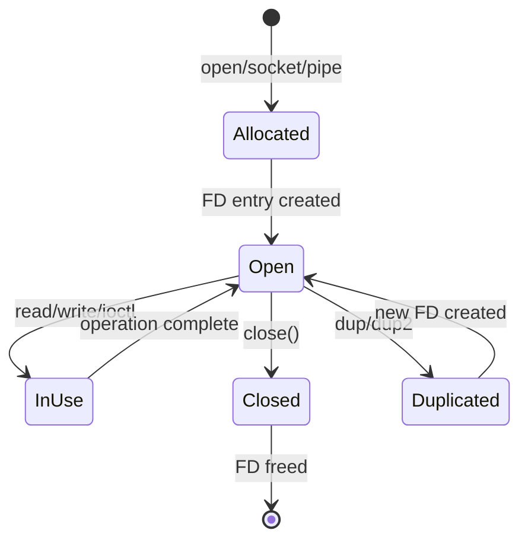

# 🔄 Syscall Flow in gem5

## Table of Contents
- [Overview](#overview)
- [Complete Execution Flow](#complete-execution-flow)
- [Detailed Examples](#detailed-examples)
- [State Transitions](#state-transitions)
- [Error Handling](#error-handling)
- [Performance Analysis](#performance-analysis)

---

## Overview

This document provides a detailed walkthrough of how system calls flow through gem5's emulation layer, from the moment a simulated program executes a syscall instruction to when control returns to the application.

---

## Complete Execution Flow

### High-Level Overview



### Step-by-Step Execution

#### Phase 1: Syscall Invocation

**1. Application executes syscall**

```c
// Application code
int fd = open("/tmp/file.txt", O_RDWR | O_CREAT, 0644);
```

**2. Compiler generates syscall sequence**

```asm
; x86-64 Linux ABI
mov    rax, 2              ; syscall number for open
lea    rdi, [rip+pathname] ; arg0: const char *pathname
mov    esi, 66             ; arg1: int flags (O_RDWR|O_CREAT)
mov    edx, 420            ; arg2: mode_t mode (0644 octal)
syscall                     ; invoke syscall
; return value in rax
```

**3. CPU detects syscall instruction**

```cpp
// In src/arch/x86/isa.cc
void
ISA::handleSyscall(ThreadContext *tc)
{
    // Save registers
    RegVal rax = tc->readIntReg(INTREG_RAX);  // syscall number
    
    // Delegate to process
    Process *process = tc->getProcessPtr();
    process->syscall(rax, tc);
}
```

#### Phase 2: Syscall Dispatch

**4. Process looks up syscall descriptor**

```cpp
// In src/sim/process.cc
void
Process::syscall(int64_t callnum, ThreadContext *tc)
{
    // Get descriptor for this syscall number
    SyscallDesc *desc = getDesc(callnum);
    
    if (!desc) {
        warn("Syscall %d not implemented", callnum);
        return -ENOSYS;
    }
    
    // Execute the handler
    SyscallReturn retval = desc->doSyscall(tc);
    
    // Write return value to register
    setSyscallReturn(tc, retval);
}
```

**5. Syscall descriptor invokes handler**

```cpp
// In src/sim/syscall_desc.cc
SyscallReturn
SyscallDesc::doSyscall(ThreadContext *tc)
{
    // Check if implemented
    if (flags & Unimplemented) {
        warn("Syscall %s not implemented", name);
        return -ENOSYS;
    }
    
    // Invoke the actual handler function
    return (*execFunc)(this, tc);
}
```

#### Phase 3: Handler Execution

**6. Handler extracts arguments**

```cpp
// In src/sim/syscall_emul.hh
template <class OS>
SyscallReturn
openFunc(SyscallDesc *desc, ThreadContext *tc)
{
    // Get process and ABI
    auto process = tc->getProcessPtr();
    auto &abi = tc->getSystemPtr()->getGuestABI();
    
    // Extract arguments using ABI
    Addr pathname_addr;
    int flags, mode;
    
    abi.getArgument(tc, 0, pathname_addr);
    abi.getArgument(tc, 1, flags);
    abi.getArgument(tc, 2, mode);
    
    DPRINTF(Syscall, "open: pathname=%#x flags=%#x mode=%#x\n",
            pathname_addr, flags, mode);
    
    // Continue processing...
}
```

**7. Read data from simulated memory**

```cpp
    // Get virtual memory proxy
    auto &proxy = tc->getVirtProxy();
    
    // Read pathname string
    std::string pathname;
    if (!proxy.tryReadString(pathname, pathname_addr)) {
        warn("open: couldn't read pathname at %#x", pathname_addr);
        return -EFAULT;
    }
    
    DPRINTF(Syscall, "open: path='%s'\n", pathname);
```

**8. Apply path redirections**

```cpp
    // Redirect special paths
    pathname = process->checkPathRedirect(pathname);
    
    // Examples of redirections:
    // /proc/cpuinfo -> host file with simulated CPU info
    // /sys/devices  -> emulated device tree
    // /dev/null     -> host /dev/null
```

**9. Translate flags and modes**

```cpp
    // Convert target OS flags to host flags
    int host_flags = 0;
    
    if (flags & OS::TGT_O_RDONLY) host_flags |= O_RDONLY;
    if (flags & OS::TGT_O_WRONLY) host_flags |= O_WRONLY;
    if (flags & OS::TGT_O_RDWR)   host_flags |= O_RDWR;
    if (flags & OS::TGT_O_CREAT)  host_flags |= O_CREAT;
    if (flags & OS::TGT_O_TRUNC)  host_flags |= O_TRUNC;
    // ... more flags
    
    mode_t host_mode = OS::convertMode(mode);
```

**10. Perform host syscall**

```cpp
    // Open file on host
    int host_fd = ::open(pathname.c_str(), host_flags, host_mode);
    
    if (host_fd == -1) {
        // Syscall failed, return error
        int error = errno;
        DPRINTF(Syscall, "open failed: %s\n", strerror(error));
        return -error;
    }
    
    DPRINTF(Syscall, "open succeeded: host_fd=%d\n", host_fd);
```

**11. Create FD entry and allocate target FD**

```cpp
    // Create FD entry
    auto fde = std::make_shared<FileFDEntry>(
        host_fd,     // host file descriptor
        flags,       // original flags
        pathname,    // file path
        false        // not a pipe
    );
    
    // Allocate target FD
    int target_fd = process->fds->allocFD(fde);
    
    DPRINTF(Syscall, "allocated target_fd=%d (host_fd=%d)\n",
            target_fd, host_fd);
```

**12. Return value to simulated program**

```cpp
    // Return target FD
    return SyscallReturn(target_fd);
}
```

#### Phase 4: Return to Application

**13. Set return value in register**

```cpp
// Back in Process::syscall()
void
Process::setSyscallReturn(ThreadContext *tc, SyscallReturn retval)
{
    // x86-64: return value in RAX
    tc->setIntReg(INTREG_RAX, retval.value());
    
    // Some architectures use multiple registers
    // ARM: r0 (value) and r1 (carry/error flag)
}
```

**14. Resume execution**

```cpp
// CPU continues execution
void
CPU::handleSyscallReturn()
{
    // Advance PC past syscall instruction
    tc->pcState(tc->pcState().advance());
    
    // Resume normal execution
    continueExecution();
}
```

**15. Application receives result**

```c
// Back in application
int fd = open("/tmp/file.txt", O_RDWR | O_CREAT, 0644);
// fd now contains 3 (target FD)
// which maps to host_fd 42

if (fd < 0) {
    perror("open failed");
    exit(1);
}
// Success! Can now use fd for read/write
```

---

## Detailed Examples

### Example 1: Simple Read Operation

**Application Code:**
```c
char buffer[1024];
ssize_t n = read(fd, buffer, sizeof(buffer));
```

**Complete Flow:**



**Handler Code:**

```cpp
template <class OS>
SyscallReturn
readFunc(SyscallDesc *desc, ThreadContext *tc)
{
    // Extract arguments
    int target_fd = tc->readIntReg(ArgumentReg0);
    Addr buf_ptr = tc->readIntReg(ArgumentReg1);
    size_t nbytes = tc->readIntReg(ArgumentReg2);
    
    // Get FD entry
    auto process = tc->getProcessPtr();
    auto fde = process->fds->getFDEntry(target_fd);
    if (!fde)
        return -EBADF;
    
    // Allocate temporary host buffer
    std::vector<uint8_t> host_buf(nbytes);
    
    // Read from host FD
    ssize_t bytes_read = fde->read(host_buf.data(), nbytes);
    
    if (bytes_read < 0)
        return -errno;
    
    // Copy to guest memory
    auto &proxy = tc->getVirtProxy();
    proxy.writeBlob(buf_ptr, host_buf.data(), bytes_read);
    
    return bytes_read;
}
```

### Example 2: Fork System Call

**Application Code:**
```c
pid_t pid = fork();
if (pid == 0) {
    // Child process
    printf("I'm the child\n");
} else {
    // Parent process
    printf("I'm the parent, child pid = %d\n", pid);
}
```

**Flow Diagram:**



**Handler Code:**

```cpp
template <class OS>
SyscallReturn
forkFunc(SyscallDesc *desc, ThreadContext *tc)
{
    auto process = tc->getProcessPtr();
    auto system = tc->getSystemPtr();
    
    // Check if we can create another process
    if (system->numRunningContexts() >= system->numContexts())
        return -EAGAIN;
    
    // Clone the process
    Process *child_process = process->clone();
    
    // Clone memory state (copy-on-write)
    child_process->memState = process->memState->clone();
    
    // Clone FD array (shared file descriptors)
    child_process->fds = process->fds->clone();
    
    // Get free thread context for child
    ThreadContext *child_tc = system->allocThreadContext();
    child_process->assignThreadContext(child_tc);
    
    // Copy register state
    for (int i = 0; i < NumIntRegs; i++)
        child_tc->setIntReg(i, tc->readIntReg(i));
    
    // Copy PC
    child_tc->pcState(tc->pcState());
    
    // Generate child PID
    pid_t child_pid = child_process->pid();
    
    // Parent returns child PID
    // (Child return is set up separately in child context)
    return child_pid;
}
```

### Example 3: mmap System Call

**Application Code:**
```c
void *addr = mmap(NULL, 4096, PROT_READ | PROT_WRITE,
                  MAP_PRIVATE | MAP_ANONYMOUS, -1, 0);
```

**Memory State Changes:**

```
Before mmap:
┌─────────────────┐
│   Stack         │ 0xBFFF_F000
├─────────────────┤
│   (free)        │
├─────────────────┤
│   Heap          │ 0x0060_0000
└─────────────────┘

After mmap:
┌─────────────────┐
│   Stack         │ 0xBFFF_F000
├─────────────────┤
│   (free)        │
├─────────────────┤
│   mmap'd region │ 0x7000_0000 (newly allocated)
│   4KB RW        │
├─────────────────┤
│   (free)        │
├─────────────────┤
│   Heap          │ 0x0060_0000
└─────────────────┘
```

**Handler Code:**

```cpp
template <class OS>
SyscallReturn
mmapFunc(SyscallDesc *desc, ThreadContext *tc)
{
    // Extract arguments
    Addr start = tc->readIntReg(ArgumentReg0);
    size_t length = tc->readIntReg(ArgumentReg1);
    int prot = tc->readIntReg(ArgumentReg2);
    int flags = tc->readIntReg(ArgumentReg3);
    int fd = tc->readIntReg(ArgumentReg4);
    off_t offset = tc->readIntReg(ArgumentReg5);
    
    auto process = tc->getProcessPtr();
    auto mem_state = process->memState;
    
    // Determine address
    if (start == 0 || (flags & MAP_FIXED) == 0) {
        // Allocate address from mmap region
        start = mem_state->allocateMmapRegion(length);
    }
    
    // Check if file-backed or anonymous
    if (flags & MAP_ANONYMOUS) {
        // Anonymous mapping - allocate pages
        process->allocateMem(start, length, true);
    } else {
        // File-backed mapping
        auto fde = process->fds->getFDEntry(fd);
        if (!fde)
            return -EBADF;
        
        // Read file content into memory
        std::vector<uint8_t> buffer(length);
        fde->pread(buffer.data(), length, offset);
        
        // Write to guest memory
        tc->getVirtProxy().writeBlob(start, buffer.data(), length);
    }
    
    // Update page table protections
    auto page_table = tc->getProcessPtr()->pTable;
    for (Addr addr = start; addr < start + length; addr += PageBytes) {
        page_table->remap(addr, PageBytes, protectionFromProt(prot));
    }
    
    // Record VMA
    mem_state->addVMA(start, length, prot, flags);
    
    return start;
}
```

---

## State Transitions

### Process State Machine

```mermaid
stateDiagram-v2
    [*] --> Created: Process::Process()
    Created --> Initialized: initState()
    Initialized --> Running: first syscall
    Running --> Running: normal syscalls
    Running --> Blocked: blocking syscall
    Blocked --> Running: I/O complete
    Running --> Zombie: exit()
    Zombie --> [*]: parent wait()
```

### FD Lifecycle



---

## Error Handling

### Error Code Translation

gem5 must translate between target and host error codes:

```cpp
// Target error codes (from target OS)
#define TGT_EPERM     1
#define TGT_ENOENT    2
#define TGT_EINTR     4
// ...

// Host error codes (from host OS)
#include <errno.h>  // EPERM, ENOENT, EINTR, ...

// Translation function
template <class OS>
int
translateError(int host_error)
{
    // Most Unix systems use same values, but not guaranteed
    static const std::map<int, int> errorMap = {
        {EPERM, OS::TGT_EPERM},
        {ENOENT, OS::TGT_ENOENT},
        {EINTR, OS::TGT_EINTR},
        // ...
    };
    
    auto it = errorMap.find(host_error);
    if (it != errorMap.end())
        return it->second;
    
    // Fallback: assume same values
    return host_error;
}
```

### Handling Failures

```cpp
SyscallReturn
exampleSyscall(SyscallDesc *desc, ThreadContext *tc)
{
    // Multiple points of failure
    
    // 1. Invalid arguments
    if (arg < 0 || arg > MAX_VALUE)
        return -EINVAL;
    
    // 2. Permission denied
    if (!hasPermission())
        return -EACCES;
    
    // 3. Resource unavailable
    if (!allocateResource())
        return -ENOMEM;
    
    // 4. Host syscall failure
    int result = host_syscall();
    if (result < 0)
        return -errno;  // errno from host
    
    // Success
    return result;
}
```

### Partial Operations

Some syscalls may partially succeed:

```cpp
SyscallReturn
writeFunc(/* ... */, size_t count)
{
    size_t written = 0;
    
    while (written < count) {
        ssize_t n = ::write(host_fd, buffer + written, count - written);
        
        if (n < 0) {
            if (errno == EINTR)
                continue;  // Retry on interrupt
            
            // Return bytes written so far, or error if nothing written
            return written > 0 ? written : -errno;
        }
        
        written += n;
    }
    
    return written;
}
```

---

## Performance Analysis

### Overhead Breakdown

For a typical `read()` syscall:

```
Total overhead: ~1000-10000 cycles
├─ Syscall dispatch: 100-200 cycles
│  ├─ Trap handling: 50 cycles
│  ├─ Descriptor lookup: 20 cycles
│  └─ Argument extraction: 30 cycles
├─ Address translation: 200-500 cycles
│  ├─ TLB lookups: 100 cycles
│  └─ Page table walks: 100-400 cycles
├─ Memory copy: 500-2000 cycles
│  ├─ Host read: 200-1000 cycles
│  └─ Guest write: 300-1000 cycles
└─ Return handling: 100-200 cycles
```

### Optimization Opportunities

1. **Fast-path for common syscalls**
   ```cpp
   if (likely(isSimpleSyscall(callnum)))
       return fastPath(callnum, tc);
   ```

2. **Cache descriptor lookups**
   ```cpp
   static thread_local SyscallDesc *last_desc = nullptr;
   if (last_desc && last_desc->number == callnum)
       return last_desc;
   ```

3. **Batch memory operations**
   ```cpp
   // Instead of multiple small copies
   proxy.writeBlob(addr, buffer, total_size);
   
   // Do single large copy
   ```

---

## Debugging Syscall Flow

### Enable Debug Output

```bash
# Basic syscall tracing
./gem5.opt --debug-flags=Syscall config.py

# Verbose syscall details
./gem5.opt --debug-flags=SyscallVerbose config.py

# All syscall-related output
./gem5.opt --debug-flags=SyscallAll config.py
```

### Example Debug Output

```
      0: system.cpu: Syscall 2 (open) called
      0:   arg0 = 0x7fffffffe100
      0:   arg1 = 0x42 (O_RDWR|O_CREAT)
      0:   arg2 = 0x1a4 (0644)
      0: Syscall: open: pathname='/tmp/test.txt' flags=66 mode=420
      0: Syscall: open: redirected path='/tmp/test.txt'
      0: Syscall: open: host open returned fd=5
      0: Syscall: open: allocated target_fd=3
      0: system.cpu: Syscall 2 (open) returned 3
```

### Tracing with gdb

```bash
# Attach gdb to gem5
gdb --args ./gem5.opt --debug-flags=Syscall config.py

# Set breakpoints
(gdb) break openFunc
(gdb) break Process::syscall
(gdb) break SyscallDesc::doSyscall

# Run and inspect
(gdb) run
(gdb) print tc->readIntReg(ArgumentReg0)
(gdb) print *process->fds
```

---

## Summary

The syscall flow in gem5 involves:

1. **Detection** - CPU traps on syscall instruction
2. **Dispatch** - Look up handler from syscall table
3. **Translation** - Convert arguments and addresses
4. **Execution** - Invoke host syscall or emulate
5. **Return** - Write result back to simulated program

Understanding this flow is crucial for:
- Debugging syscall-related issues
- Implementing new syscalls
- Optimizing syscall performance
- Extending gem5's capabilities

---

**[⬆ back to top](#-syscall-flow-in-gem5)**
