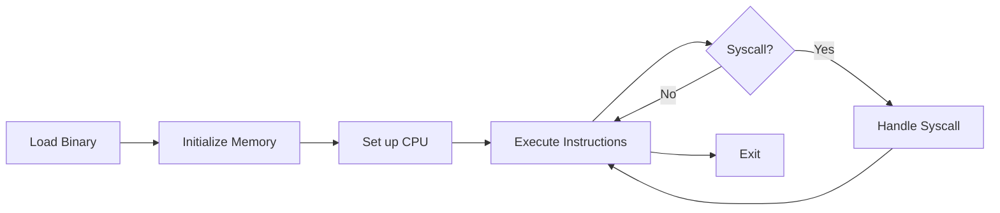

# 📖 gem5 Syscall Emulation Tutorial: From Zero to Hero

## Table of Contents

1. [Introduction](#introduction)
2. [Prerequisites](#prerequisites)
3. [Level 1: First Steps](#level-1-first-steps)
4. [Level 2: Understanding Syscalls](#level-2-understanding-syscalls)
5. [Level 3: Advanced Topics](#level-3-advanced-topics)
6. [Level 4: Expert Techniques](#level-4-expert-techniques)

---

## Introduction

Welcome to the complete gem5 syscall emulation tutorial! This guide will take you from beginner to expert, with hands-on examples and detailed explanations.

### What You'll Learn

- ✅ How to run programs in gem5 SE mode
- ✅ Understanding syscall flow and internals
- ✅ Debugging syscall-related issues
- ✅ Implementing custom syscalls
- ✅ Performance optimization techniques
- ✅ Advanced gem5 features

### Time Investment

- **Level 1:** 30 minutes - Get started quickly
- **Level 2:** 2 hours - Deep understanding
- **Level 3:** 4 hours - Advanced techniques
- **Level 4:** 8+ hours - Expert mastery

---

## Prerequisites

### Required Knowledge

- Basic C programming
- Command-line proficiency
- Understanding of operating systems concepts (processes, memory, files)

### Software Requirements

```bash
# Install gem5 dependencies (Ubuntu/Debian)
sudo apt-get install build-essential git m4 scons zlib1g zlib1g-dev \
    libprotobuf-dev protobuf-compiler libprotoc-dev libgoogle-perftools-dev \
    python3-dev python-is-python3 doxygen libboost-all-dev \
    libhdf5-serial-dev python3-pydot libpng-dev

# Clone gem5
git clone https://github.com/gem5/gem5.git
cd gem5

# Build gem5 (this takes 15-30 minutes)
scons build/X86/gem5.opt -j$(nproc)
```

---

## Level 1: First Steps

### 1.1: Your First Simulation

Let's start with the simplest possible program:

**Step 1: Create a test program**

```c
// hello.c
#include <stdio.h>

int main() {
    printf("Hello gem5!\n");
    return 0;
}
```

**Step 2: Compile it**

```bash
gcc -static -o hello hello.c
```

> 💡 **Why `-static`?** Static linking includes all library code in the binary, making it self-contained for gem5.

**Step 3: Create gem5 config**

```python
# simple_se.py
import m5
from m5.objects import *

# Create system
system = System()
system.clk_domain = SrcClockDomain()
system.clk_domain.clock = '1GHz'
system.clk_domain.voltage_domain = VoltageDomain()
system.mem_mode = 'timing'
system.mem_ranges = [AddrRange('512MB')]

# Create CPU
system.cpu = AtomicSimpleCPU()

# Create memory bus
system.membus = SystemXBar()
system.cpu.icache_port = system.membus.cpu_side_ports
system.cpu.dcache_port = system.membus.cpu_side_ports

# Create interrupt controller
system.cpu.createInterruptController()

# Create memory controller
system.mem_ctrl = MemCtrl()
system.mem_ctrl.dram = DDR3_1600_8x8()
system.mem_ctrl.dram.range = system.mem_ranges[0]
system.mem_ctrl.port = system.membus.mem_side_ports

# System port
system.system_port = system.membus.cpu_side_ports

# Set workload
system.workload = SEWorkload.init_compatible('hello')

# Create process
process = Process()
process.cmd = ['hello']
system.cpu.workload = process
system.cpu.createThreads()

# Run simulation
root = Root(full_system=False, system=system)
m5.instantiate()
print("Running simulation...")
exit_event = m5.simulate()
print(f"Exiting @ tick {m5.curTick()}")
```

**Step 4: Run it!**

```bash
./build/X86/gem5.opt simple_se.py
```

**Expected output:**

```
gem5 Simulator System.  http://gem5.org
...
Running simulation...
Hello gem5!
Exiting @ tick 507439000
```

🎉 **Congratulations!** You've run your first gem5 simulation!

### 1.2: Understanding What Happened

Let's break down what gem5 did:



1. **Loaded binary**: gem5 parsed the ELF file and loaded code/data into simulated memory
2. **Initialized CPU**: Set up registers, program counter, stack pointer
3. **Executed instructions**: Simulated x86-64 instructions one by one
4. **Handled syscalls**: When `printf` called `write()`, gem5 intercepted it
5. **Exited cleanly**: When `main` returned, gem5 caught the `exit()` syscall

### 1.3: Enabling Debug Output

Let's see what syscalls were made:

```bash
./build/X86/gem5.opt --debug-flags=Syscall simple_se.py 2>&1 | grep syscall
```

Output:

```
      0: system.cpu T0 : @_start+123 : syscall brk (0)
   1000: system.cpu T0 : @_start+456 : syscall access ("/etc/ld.so.preload", 4)
   2000: system.cpu T0 : @main+234 : syscall write (1, 0x401234, 12)
   3000: system.cpu T0 : @main+567 : syscall exit_group (0)
```

> 🔍 **Analysis**: Even a simple program makes multiple syscalls during startup and execution.

---

## Level 2: Understanding Syscalls

### 2.1: Anatomy of a Syscall

Let's trace a single `write()` syscall in detail:

**C code:**
```c
write(1, "Hello\n", 6);
```

**Compiled assembly (x86-64):**
```asm
mov    rax, 1              ; syscall number (write = 1)
mov    rdi, 1              ; arg0: fd = 1 (stdout)
lea    rsi, [rip+msg]      ; arg1: buffer = address of "Hello\n"
mov    rdx, 6              ; arg2: count = 6
syscall                     ; invoke syscall
```

**gem5 handling:**

```cpp
// 1. CPU traps on syscall instruction
void handleSyscall(ThreadContext *tc) {
    int callnum = tc->readIntReg(RAX);  // Get syscall number
    process->syscall(callnum, tc);      // Dispatch
}

// 2. Look up handler
SyscallDesc *desc = syscall_table[callnum];  // write handler

// 3. Extract arguments
int fd = tc->readIntReg(RDI);      // fd = 1
Addr buf = tc->readIntReg(RSI);    // buffer address
size_t len = tc->readIntReg(RDX);  // length = 6

// 4. Read data from simulated memory
char host_buf[6];
tc->getVirtProxy().readBlob(buf, host_buf, len);

// 5. Get FD entry (translates target fd=1 to host stdout)
FDEntry *fde = process->fds[fd];

// 6. Perform host write
ssize_t result = fde->write(host_buf, len);

// 7. Return result to simulated program
tc->setIntReg(RAX, result);  // RAX = 6 (bytes written)
```

### 2.2: File Descriptor Translation

A key concept in gem5 SE mode is **FD translation**:

```
┌─────────────────────────────────────┐
│   Simulated Program's View          │
│                                     │
│   fd 0 → stdin                      │
│   fd 1 → stdout                     │
│   fd 2 → stderr                     │
│   fd 3 → "/tmp/file.txt"            │
│   fd 4 → socket                     │
└─────────────────────────────────────┘
         ↓ translation ↓
┌─────────────────────────────────────┐
│   Host System Reality               │
│                                     │
│   fd 0 → host stdin                 │
│   fd 1 → host stdout                │
│   fd 2 → host stderr                │
│   fd 42 → "/tmp/file.txt"           │
│   fd 43 → socket                    │
└─────────────────────────────────────┘
```

**Why translate?**
- Simulated program expects specific FD numbers
- Host system may use different FD numbers
- Allows isolation and testing

**Example code:**

```c
// Simulated program
int fd = open("/tmp/test.txt", O_RDWR);  // Returns fd=3
write(fd, "data", 4);                    // Uses fd=3
close(fd);                               // Closes fd=3

// gem5 internally:
// open() → host_fd=42, maps to target_fd=3
// write(3, ...) → looks up mapping → write(42, ...)
// close(3) → looks up mapping → close(42), removes mapping
```

### 2.3: Memory Address Translation

Another critical aspect is **virtual memory translation**:

```c
char buffer[1024];
read(fd, buffer, 1024);
```

**What gem5 does:**

1. **Extract buffer address** from RSI register (e.g., `0x7fffffffe000`)
2. **Translate guest address to host address** using page tables
3. **Read from host FD into host memory**
4. **Copy data to simulated memory** at guest address

```cpp
// Simplified gem5 code
Addr guest_addr = tc->readIntReg(RSI);    // 0x7fffffffe000
Addr host_addr = translateAddress(guest_addr);  // 0x12345000

// Read into temporary host buffer
char temp_buf[1024];
ssize_t n = read(host_fd, temp_buf, 1024);

// Copy to guest memory
writeToGuestMemory(guest_addr, temp_buf, n);
```

### 2.4: Hands-On Exercise 1

**Task:** Trace syscalls for a file I/O program

```c
// fileio.c
#include <fcntl.h>
#include <unistd.h>
#include <stdio.h>

int main() {
    int fd = open("/tmp/test.txt", O_CREAT | O_WRONLY, 0644);
    if (fd < 0) {
        perror("open");
        return 1;
    }
    
    write(fd, "Hello from gem5!\n", 17);
    close(fd);
    
    printf("File written successfully\n");
    return 0;
}
```

**Steps:**

1. Compile: `gcc -static -o fileio fileio.c`
2. Run with debug: `gem5.opt --debug-flags=SyscallVerbose simple_se.py fileio`
3. Analyze output: What syscalls were made?
4. Check result: `cat /tmp/test.txt`

**Expected syscalls:**
- `open("/tmp/test.txt", O_CREAT|O_WRONLY, 0644)` → returns fd
- `write(fd, buffer, 17)` → writes data
- `close(fd)` → closes file
- `write(1, "File written...", 26)` → printf
- `exit_group(0)` → exit

---

## Level 3: Advanced Topics

### 3.1: Implementing a Custom Syscall

Let's add a custom syscall to gem5!

**Step 1: Define the syscall**

```cpp
// In src/sim/syscall_emul.hh

template <class OS>
SyscallReturn
myCustomSyscallFunc(SyscallDesc *desc, ThreadContext *tc)
{
    // Extract arguments
    int arg1 = tc->readIntReg(ArgumentReg0);
    int arg2 = tc->readIntReg(ArgumentReg1);
    
    // Do something interesting
    int result = arg1 + arg2;
    
    DPRINTF(Syscall, "myCustomSyscall(%d, %d) = %d\n", arg1, arg2, result);
    
    return result;
}
```

**Step 2: Add to syscall table**

```cpp
// In src/arch/x86/linux/syscall_tbl.hh

{ 548, "my_custom_syscall", myCustomSyscallFunc }
```

**Step 3: Rebuild gem5**

```bash
scons build/X86/gem5.opt -j$(nproc)
```

**Step 4: Use it**

```c
// test_custom.c
#include <unistd.h>
#include <sys/syscall.h>
#include <stdio.h>

#define SYS_my_custom_syscall 548

int main() {
    long result = syscall(SYS_my_custom_syscall, 10, 20);
    printf("Custom syscall returned: %ld\n", result);
    return 0;
}
```

### 3.2: Debugging Syscall Issues

**Problem:** Your program crashes or behaves incorrectly in gem5.

**Debugging strategy:**

1. **Compare with native execution**
   ```bash
   # Run natively
   ./program
   
   # Run with strace
   strace -o native.trace ./program
   
   # Run with gem5
   gem5.opt --debug-flags=SyscallAll config.py program
   
   # Compare traces
   diff native.trace gem5.trace
   ```

2. **Check for unimplemented syscalls**
   ```bash
   gem5.opt config.py program 2>&1 | grep "not implemented"
   ```

3. **Verify arguments**
   ```bash
   gem5.opt --debug-flags=SyscallVerbose config.py program 2>&1 | grep syscall
   ```

4. **Use gdb**
   ```bash
   gdb --args gem5.opt config.py program
   (gdb) break Process::syscall
   (gdb) run
   ```

### 3.3: Performance Optimization

**Challenge:** gem5 SE mode is slow. How to speed it up?

**Techniques:**

1. **Use atomic CPU model**
   ```python
   system.cpu = AtomicSimpleCPU()  # Fastest, least detailed
   # vs
   system.cpu = TimingSimpleCPU()  # Slower, more detailed
   # vs
   system.cpu = O3CPU()            # Slowest, most detailed
   ```

2. **Fast-forward with KVM**
   ```python
   # Use KVM for initialization, then switch to detailed model
   system.cpu = X86KvmCPU()
   # ... simulate init phase ...
   system.cpu = O3CPU()
   # ... simulate region of interest ...
   ```

3. **Reduce memory size**
   ```python
   system.mem_ranges = [AddrRange('512MB')]  # Instead of 2GB
   ```

4. **Disable unnecessary debug output**
   ```bash
   # Don't use --debug-flags unless needed
   gem5.opt config.py  # Fast
   gem5.opt --debug-flags=SyscallAll config.py  # Slow
   ```

### 3.4: Hands-On Exercise 2

**Task:** Profile syscall overhead

Create a program that makes many syscalls:

```c
// syscall_benchmark.c
#include <unistd.h>
#include <fcntl.h>
#include <sys/time.h>
#include <stdio.h>

int main() {
    struct timeval start, end;
    int i;
    
    gettimeofday(&start, NULL);
    
    // Make 10000 getpid syscalls
    for (i = 0; i < 10000; i++) {
        getpid();
    }
    
    gettimeofday(&end, NULL);
    
    long usec = (end.tv_sec - start.tv_sec) * 1000000 +
                (end.tv_usec - start.tv_usec);
    
    printf("10000 syscalls in %ld microseconds\n", usec);
    printf("Average: %.2f usec/syscall\n", usec / 10000.0);
    
    return 0;
}
```

Run both natively and in gem5, compare results!

---

## Level 4: Expert Techniques

### 4.1: Multi-Process Simulation

Simulating fork/exec:

```c
// multiprocess.c
#include <unistd.h>
#include <sys/wait.h>
#include <stdio.h>

int main() {
    pid_t pid = fork();
    
    if (pid == 0) {
        // Child process
        printf("Child: PID=%d\n", getpid());
        execl("/bin/ls", "ls", "-l", NULL);
    } else {
        // Parent process
        printf("Parent: PID=%d, child=%d\n", getpid(), pid);
        wait(NULL);
        printf("Child exited\n");
    }
    
    return 0;
}
```

**gem5 config for multi-process:**

```python
# multi_process.py
system.cpu = [AtomicSimpleCPU() for i in range(4)]  # 4 CPUs

# First process
process1 = Process()
process1.cmd = ['multiprocess']
system.cpu[0].workload = process1
system.cpu[0].createThreads()

# Child processes will be allocated dynamically to other CPUs
```

### 4.2: Custom FD Types

Implementing a custom FD type:

```cpp
// Custom pipe FD with logging
class LoggingPipeFDEntry : public PipeFDEntry
{
  public:
    ssize_t read(uint8_t *buf, size_t len) override {
        ssize_t n = PipeFDEntry::read(buf, len);
        DPRINTF(CustomFD, "Read %zd bytes from pipe\n", n);
        return n;
    }
    
    ssize_t write(const uint8_t *buf, size_t len) override {
        DPRINTF(CustomFD, "Writing %zu bytes to pipe\n", len);
        return PipeFDEntry::write(buf, len);
    }
};
```

### 4.3: Syscall Interposition

Intercepting and modifying syscalls:

```cpp
// Custom open handler that redirects paths
template <class OS>
SyscallReturn
myOpenFunc(SyscallDesc *desc, ThreadContext *tc)
{
    // Get original path
    Addr pathname_ptr = tc->readIntReg(ArgumentReg0);
    std::string path;
    tc->getVirtProxy().readString(path, pathname_ptr);
    
    // Redirect /secret/ paths to /dummy/
    if (path.find("/secret/") == 0) {
        path.replace(0, 8, "/dummy/");
        warn("Redirected secret path to: %s", path);
    }
    
    // Call original open with modified path
    return openFunc<OS>(desc, tc, pathname_ptr, ...);
}
```

### 4.4: Final Project

**Challenge:** Create a syscall security monitor

Requirements:
1. Track all file opens and flag suspicious patterns
2. Log network connections
3. Detect potential buffer overflows (large read/write)
4. Generate security report

**Hints:**
- Use custom syscall handlers
- Maintain state across syscalls
- Use debug flags for logging
- Generate JSON report at end

---

## Next Steps

Congratulations on completing the tutorial! You now have:

✅ Deep understanding of gem5 syscall emulation  
✅ Ability to debug syscall issues  
✅ Skills to extend gem5 with custom syscalls  
✅ Knowledge of performance optimization  
✅ Advanced techniques for complex scenarios  

### Continue Learning

- Read the [Architecture Guide](architecture.md)
- Explore [API Reference](api-reference.md)
- Try all [Demo Programs](../demos/)
- Use [Visualization Tools](../visualization/)
- Contribute to gem5!

### Get Help

- [gem5 Discussions](https://github.com/orgs/gem5/discussions)
- [gem5 Slack](https://www.gem5.org/join-slack)
- [Mailing Lists](https://www.gem5.org/mailing_lists)

---

**[⬆ back to top](#-gem5-syscall-emulation-tutorial-from-zero-to-hero)**
